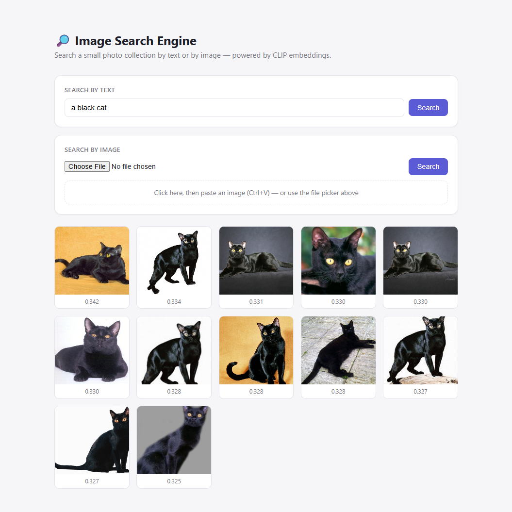
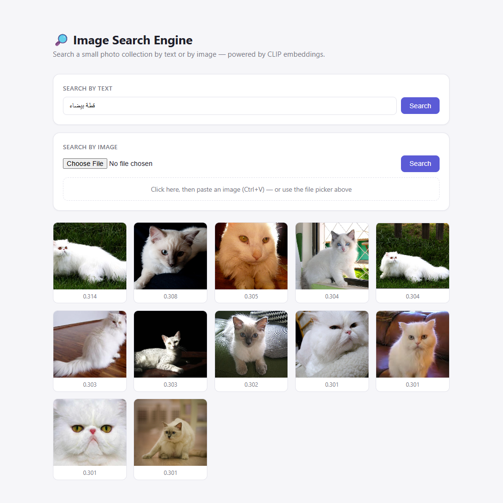
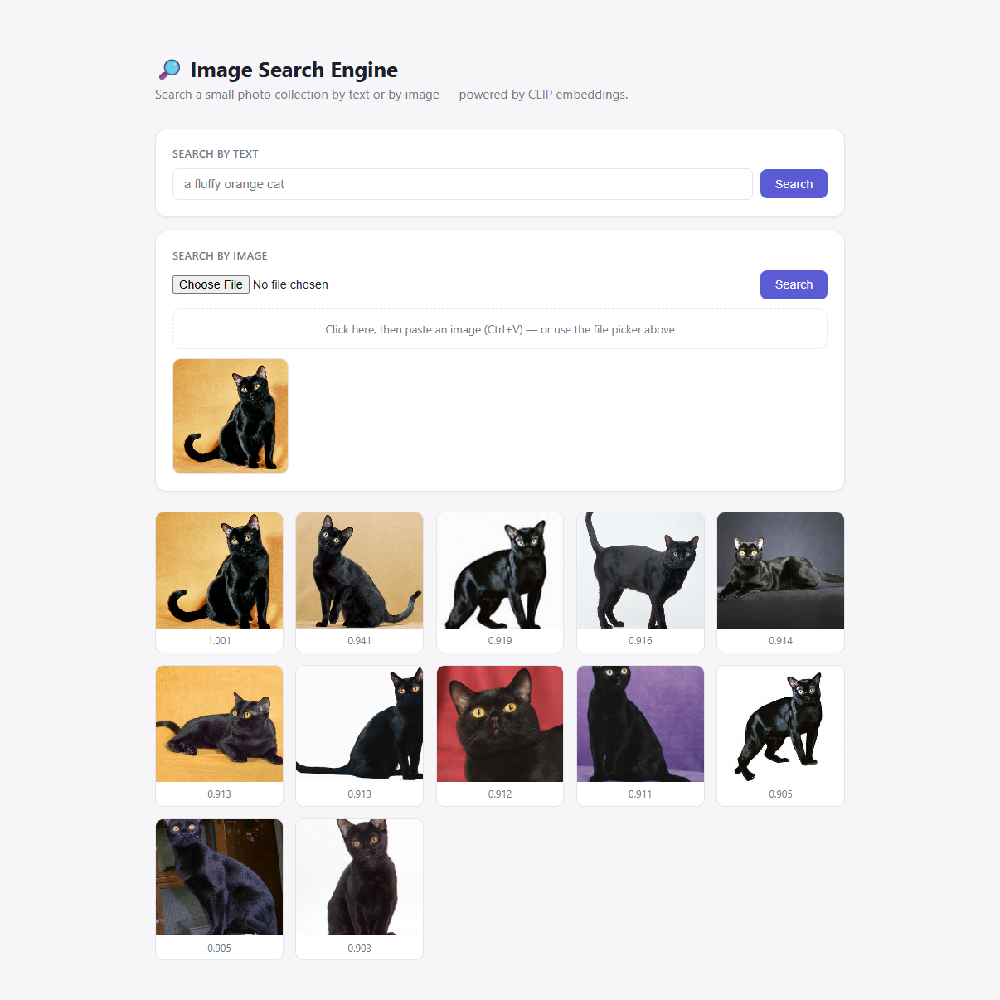

# Image Search Engine

A small image search engine that lets you search a photo collection two ways:

- **By text** — type a description ("a fluffy orange cat") and get back matching images
- **By image** — upload (or paste) a photo and get back visually similar ones

Built to learn how embedding-based search actually works, not as a production app.

## Screenshots

**Search by text**





**Search by image**



## How it works

1. **CLIP** (`sentence-transformers`) turns images and text into the same 512-number vector space — visually/semantically similar things end up with similar vectors.
   - Images are embedded with `clip-ViT-B-32`.
   - Text queries are embedded with `clip-ViT-B-32-multilingual-v1`, a separate text encoder trained to land in that same space (so queries also work in non-English languages).
2. Every image in the dataset is embedded **once** and stored in **Pinecone**, a hosted vector database, along with its file path.
3. A search just embeds the query (text or image) and asks Pinecone for the nearest stored vectors.
4. **FastAPI** exposes that as two routes; a single static HTML page calls them and renders the results with their similarity scores.

## Project structure

```
embed.py            # loads the CLIP models, embed_image() / embed_text()
vector_store.py      # Pinecone index setup, upsert() / search()
index_images.py      # one-time script: embeds the dataset and stores it in Pinecone
main.py               # FastAPI app (serves the UI + /search/text + /search/image)
static/index.html     # the web UI
data/images/          # dataset (not committed — see Setup)
```

## Dataset

[Oxford-IIIT Pet Dataset](https://www.robots.ox.ac.uk/~vgg/data/pets/) — ~7,400 cat/dog photos across 37 breeds.

## Setup

1. **Install dependencies**
   ```
   pip install -r requirements.txt
   ```

2. **Get a Pinecone API key** at [pinecone.io](https://www.pinecone.io/) and put it in a `.env` file:
   ```
   PINECONE_API_KEY=your-key-here
   ```

3. **Download the dataset** into `data/images/`:
   ```
   curl -L -o data/images.tar.gz https://www.robots.ox.ac.uk/~vgg/data/pets/data/images.tar.gz
   tar -xzf data/images.tar.gz -C data
   ```

4. **Index the images** (embeds everything and uploads to Pinecone — only needs to run once):
   ```
   python index_images.py
   ```

5. **Run the app**
   ```
   uvicorn main:app --reload
   ```
   Open http://127.0.0.1:8000

## Notes

- A GPU isn't required — `sentence-transformers` uses one automatically if available, otherwise falls back to CPU.
- **Why Pinecone over pgvector:** pgvector keeps vectors next to your relational data in Postgres — better if you already have an app database and want one less moving part, and it's free/self-hosted. Pinecone trades that for a managed, serverless index that needs zero local setup or maintenance — better for a focused project like this one where the vector store doesn't need to share infrastructure with anything else.
